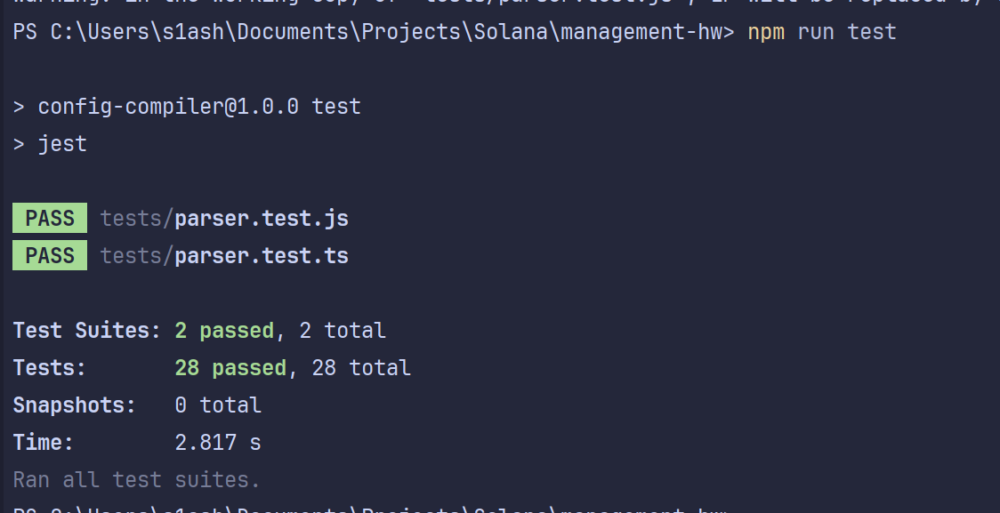

# Компилятор конфигурационного языка в TOML c инструментом ANTLR4

Это инструмент, написанный на TypeScript, который компилирует простой конфигурационный язык в формат **TOML** с использованием ANTLR4.

Язык поддерживает:
- Константы, объявляемые на этапе трансляции
- Значения, такие как числа с плавающей точкой, строки, массивы
- Вычисление константных выражений через `#[name]`
- Многострочные комментарии

## Синтаксис языка
- Многострочные комментарии:
  ```cfg
  =begin
  Это комментарий
  на несколько строк
  =end
  ```
- Числа: всегда с дробной частью, например `3.14, 8080.0, -1.5`
- Строки: в одинарных кавычках, например `'Hello World'`
- Массивы: (значение1, значение2, ...), поддерживается вложенность и пустые массивы ()
- Имена: начинаются с буквы или \_\, далее буквы, цифры, \_\. Пример: `port, max_retries, _internal_flag`
- Объявление константы: `var имя := значение`
- Ссылка на константу: `#[имя]`

## Возможности
- Рабочий компилятор
- Детальные сообщения об ошибках
- Вывод в валидный TOML с сохранением .0 для целых чисел

## Установка и сборка
```bash
git clone https://github.com/s1ashxd/cfg-to-toml.git
cd cfg-to-toml
npm install
java -jar ./antlr-4.13.1-complete.jar -Dlanguage=TypeScript -visitor -o src/generated ./Config.g4
npm run build
```

## Использование
```bash
node dist/index.js --input <входной_файл> --output <выходной_файл>
```

## Пример
Конфигурация веб-сервера (examples/web-server.cfg)
```cfg 
=begin
Конфигурация простого веб-сервера
=end[ConfigVisitorImpl.ts](src/ConfigVisitorImpl.ts)

var port := 8080.0
var host := 'localhost'
var allowed_ips := ('127.0.0.1', '192.168.1.1')
var timeout := 60.0
```
Запуск:
```bash
node dist/index.js --input examples/web-server.cfg --output server.toml
```
Результат (server.toml):
```toml
tomlport = 8080.0
host = "localhost"
allowed_ips = ["127.0.0.1", "192.168.1.1"]
timeout = 60.0
```

## Тесты
